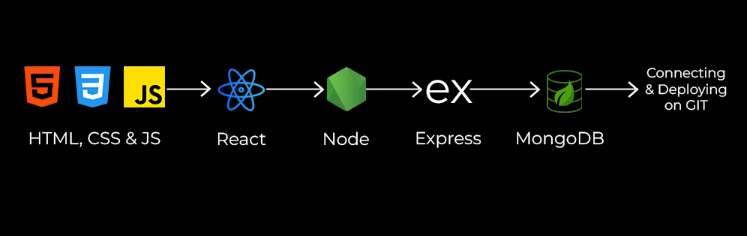

# Backend Development Training

This repository contains materials and resources for a comprehensive backend development training program focused on JavaScript, Node.js, MongoDB, MySQL, and deployment using Vercel.

## Overview

This training program will equip you with the essential concepts and practical skills to build robust and scalable backend applications using JavaScript, Node.js, and popular database technologies like MongoDB and MySQL. You'll learn how to design, develop, and deploy your applications efficiently using Vercel. Hands-on exercises and projects will solidify your learning and prepare you for real-world development challenges.

## Course Structure

The training is structured into modules covering the following topics:

- **JavaScript Fundamentals:** Review of essential JavaScript concepts.
- **Node.js and npm:** Introduction to Node.js and building server-side applications.
- **MongoDB:** Working with MongoDB, a NoSQL database.
- **MySQL:** Working with MySQL, a relational database.
- **API Development:** Designing and building RESTful APIs.
- **Authentication and Authorization:** Implementing secure authentication.
- **Testing:** Writing unit and integration tests.
- **Deployment with Vercel:** Deploying applications to Vercel.

## Image Example

 _(Replace with your actual image)_

## Getting Started

1.  **Clone the repository:**

    ```bash
    git clone <repository_url>
    ```

2.  **Set up your development environment:** Instructions for setting up Node.js, a code editor, MongoDB, MySQL, and other required software. Include detailed database connection and setup instructions.

3.  Navigate to the specific module or project directory.

## Contributing

Contributions are welcome! Please open an issue or submit a pull request.

## Instructor

Abhishek Kirar

## Contact
